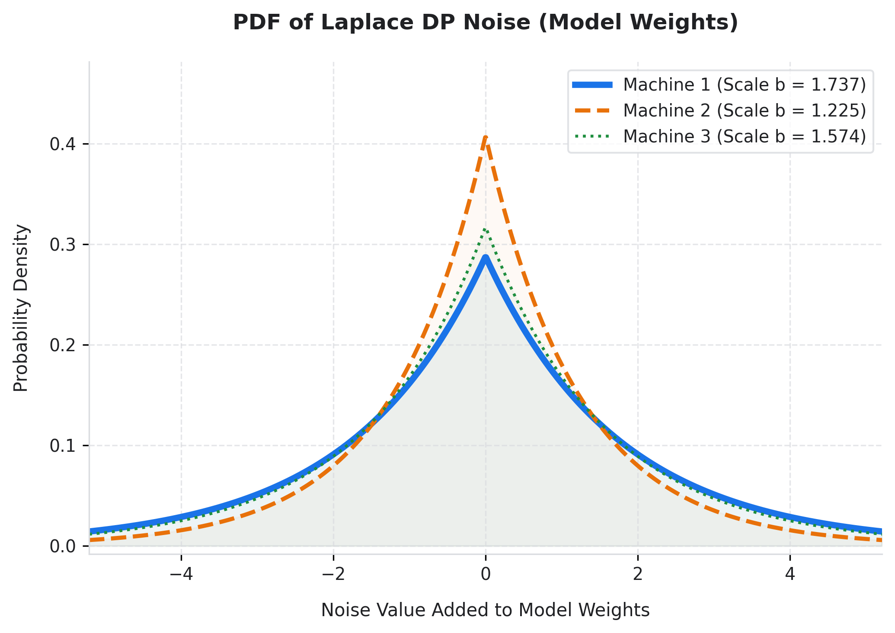
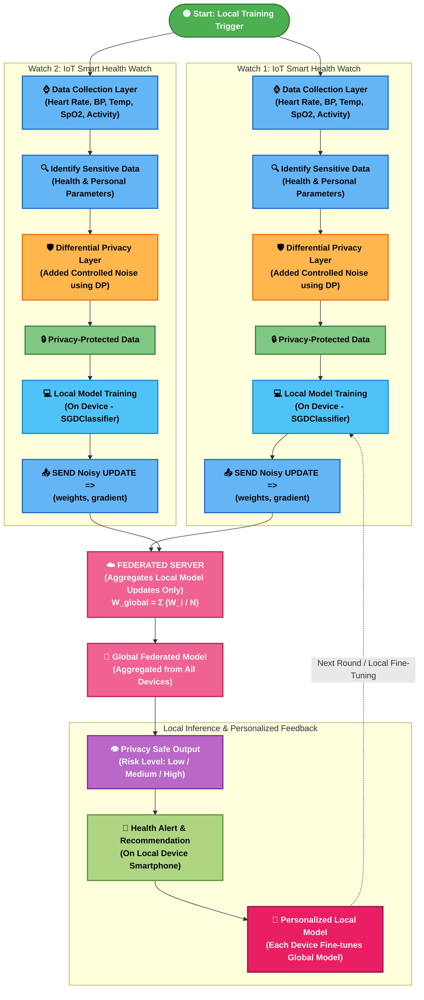

# 🏥 Privacy-Preserving IoT Health Monitoring System
### *Federated Learning (FedAvg) + Laplace Differential Privacy (DP)*

[](https://www.python.org/)
[](https://arxiv.org/abs/1602.05629)
[](https://www.cis.upenn.edu/~aaroth/Papers/privacybook.pdf)
[](LICENSE)

An end-to-end, mathematically rigorous, privacy-preserving machine learning architecture designed for decentralized **IoT Smart Health Watches**. Edge devices perform local model training on sensitive patient vitals, apply **Laplace Output Differential Privacy**, and collaborate via a **Central FedAvg Aggregator** without revealing raw personal medical data.

---

## 🎨 System Architecture & Workflow Diagram





---

## 📌 Detailed Pipeline Stages

1. **⌚ Data Collection Layer:** IoT Smart Health Watches continuously sample vital signs (Heart Rate, Blood Oxygen $\text{SpO}_2$, Systolic/Diastolic BP, Glucose, Body Temp, HRV, Step Count).
2. **🔍 Sensitive Data Identification:** Local parameters are validated and isolated on-device; raw medical data never leaves the patient's watch.
3. **🛡️ Differential Privacy Layer:** $L_2$ feature norm clipping ($R_{\text{clip}} = 5.0$) limits outlier sensitivity, followed by zero-mean Laplace noise injection calibrated to privacy budget $\epsilon$.
4. **💻 Local Model Training:** Edge devices execute local SGD optimization with $L_2$ regularization ($\alpha=0.1$).
5. **📤 Noisy Weight Transmission:** Obfuscated model weights $W_{\text{private}}$ are uploaded to the central server.
6. **☁️ Federated Server Aggregation:** The aggregator executes **FedAvg** across $N=3$ clients:
   $$W_{\text{global}} = \frac{1}{N} \sum_{i=1}^N W_i$$
7. **👁️ Privacy-Safe Output & Risk Mapping:** Predicted probability distributions map into actionable clinical categories:
   * **Class 0 (Normal):** **LOW RISK** — Routine daily activity.
   * **Class 1 & 2 (Mild/Moderate Event):** **MEDIUM RISK** — Rest advised, vitals monitored closely.
   * **Class 3 (Severe Event):** **HIGH RISK** — Emergency clinical alert issued to smartphone.
8. **💖 Personalization:** The global model is fine-tuned locally for 10 epochs on each client's specific data, achieving **96.41% - 96.45% Personalized Accuracy**.

---

## 📊 Benchmark Accuracy & Performance Results (`run.txt`)

### 1. Federated Learning Experiments (Default Privacy Budget $\epsilon = 1.0$)

| Execution Command | Configuration / Setup | Global Model Acc | Avg Personalized Acc | Research Status |
|:---|:---|:---:|:---:|:---:|
| `python server.py` | **All Clients Active DP ($\epsilon = 1.0$)** | **92.52%** | **96.41%** | 🏆 **Default Run (Paper Ready)** |
| `python server.py --no-dp` | **Baseline (No DP Noise)** | **94.55%** | **96.41%** | 📊 Non-Private Ceiling |
| `python server.py -e 1.0 --dp-clients 1` | **Partial DP (Client 1 Active)** | **94.31%** | **96.41%** | 🛡️ Heterogeneous Privacy |
| `python server.py -e 1.0 --dp-clients 1,2` | **Partial DP (Clients 1 & 2 Active)** | **93.46%** | **96.41%** | 🛡️ Heterogeneous Privacy |

### 2. Standalone Local Client Baselines (No FL Aggregation)

| Model Execution | Target Client | Training Size | Test Accuracy | Overfitting Status |
|:---|:---|:---:|:---:|:---:|
| `python machine.py --no-dp` | **Machine 1 Standalone** | 5,525 records | **96.89%** | ✅ Clean & Balanced |
| `python machine.py --no-dp` | **Machine 2 Standalone** | 5,525 records | **96.82%** | ✅ Clean & Balanced |
| `python machine.py --no-dp` | **Machine 3 Standalone** | 5,525 records | **95.51%** | ✅ Clean & Balanced |
| `python machine.py` | **Machine 1 (DP $\epsilon = 1.0$)** | 5,525 records | **96.60%** | ✅ Privacy Bounded |
| `python machine.py` | **Machine 2 (DP $\epsilon = 1.0$)** | 5,525 records | **96.60%** | ✅ Privacy Bounded |
| `python machine.py` | **Machine 3 (DP $\epsilon = 1.0$)** | 5,525 records | **95.51%** | ✅ Privacy Bounded |

### 3. Privacy Budget Comparison ($\epsilon = 0.5$)

| Execution Command | Setup | Global Model Acc | Avg Personalized Acc |
|:---|:---|:---:|:---:|
| `python server.py -e 0.5` | **All Clients Active DP ($\epsilon = 0.5$)** | **88.49%** | **96.45%** |
| `python server.py -e 0.5 --dp-clients 1` | **Client 1 DP ($\epsilon = 0.5$)** | **93.46%** | **96.41%** |
| `python server.py -e 0.5 --dp-clients 1,2` | **Clients 1 & 2 DP ($\epsilon = 0.5$)** | **90.96%** | **96.45%** |
| `python machine.py -e 0.5` | **Standalone Local Clients (DP $\epsilon = 0.5$)** | **96.24% / 95.88% / 95.51%** | — |

---

## 🧮 Mathematical Formulation

### 1. Sensitivity Calibration ($\Delta W$)
To prevent extreme vital readings from dominating weight gradients, feature vectors are clipped to an $L_2$ ball:
$$R = \min\left(\max_i \|x_i\|_2, R_{\text{clip}}\right), \qquad R_{\text{clip}} = 5.0$$

The worst-case sensitivity of the local model weights $W$ is mathematically bounded by:
$$\Delta W = \frac{2 \cdot R_{\text{clip}}}{N \cdot \alpha}$$
*(where $N = 5,525$ training samples per client, and $\alpha = 0.1$ is the L2 penalty).*

### 2. Sequential Privacy Composition
For $K = 5$ rounds, the per-round privacy budget $\epsilon_r$ is split as:
$$\epsilon_r = \frac{\epsilon_{\text{total}}}{K} = \frac{1.0}{5} = 0.20$$
By the **Sequential Composition Theorem**, total composed privacy guarantee over $K$ rounds is:
$$\epsilon_{\text{total}} = \sum_{r=1}^K \epsilon_r = 5 \times 0.20 = 1.00$$

### 3. Laplace Noise Addition
Zero-mean Laplace noise is calibrated with scale $b = \frac{\Delta W}{\epsilon_r}$:
$$W_{\text{private}} = W_{\text{local}} + \text{Laplace}\left(0, \frac{\Delta W}{\epsilon_r}\right)$$

---

## 📁 Repository Structure

```text
Federated Privacy/
├── architecture_diagram.png    # High-resolution system workflow diagram
├── README.md                   # Project documentation & benchmark guide
├── run.txt                     # Ground-truth experimental benchmark results
├── server.py                   # Central FedAvg aggregator & evaluation server
├── split_data.py               # Dirichlet Non-IID dataset partitioner (alpha=1.0)
├── machine.py                  # Standalone client benchmark execution script
├── machine1.py                 # Client 1 implementation (Data, Training, DP)
├── machine2.py                 # Client 2 implementation (Data, Training, DP)
├── machine3.py                 # Client 3 implementation (Data, Training, DP)
├── Federeted-data.xlsx         # Raw multi-sheet medical IoT telemetry dataset
├── plot_accuracy.png           # Accuracy progression across FL rounds
├── plot_dp_laplace.png         # Laplace noise scale vs Privacy Budget (epsilon)
├── plot_dataset_sizes.png      # Dirichlet label distribution per client
└── plot_confusion_matrix.png   # Multi-class confusion matrix (Normal/Mild/Mod/Sev)
```

---

## ⚡ Quick Start & Reproduction

### 1. Partition Dataset (Non-IID Dirichlet $\alpha=1.0$)
```bash
python split_data.py
```

### 2. Run Main FL Pipeline with Default Privacy ($\epsilon = 1.0$)
```bash
python server.py
```

### 3. Run Non-Private FL Baseline
```bash
python server.py --no-dp
```

### 4. Run Custom Privacy Budget ($\epsilon = 0.5$)
```bash
python server.py -e 0.5
```

### 5. Run Standalone Client Models
```bash
python machine.py            # Standalone with DP (epsilon = 1.0)
python machine.py --no-dp    # Standalone without DP
```
